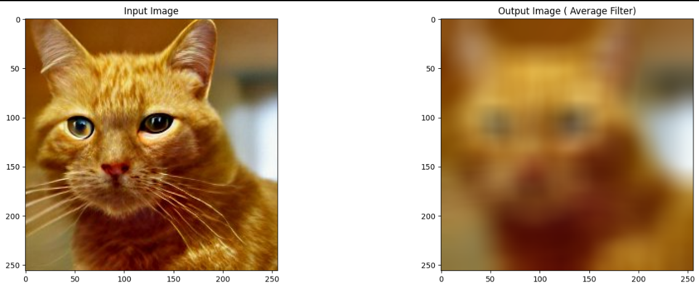
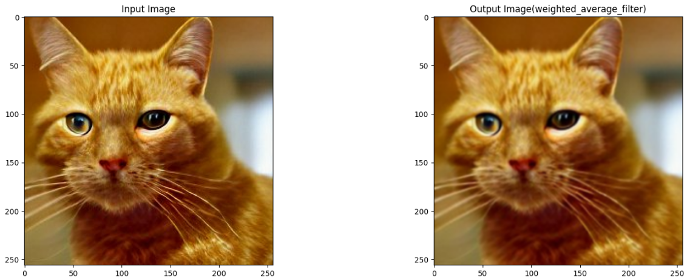
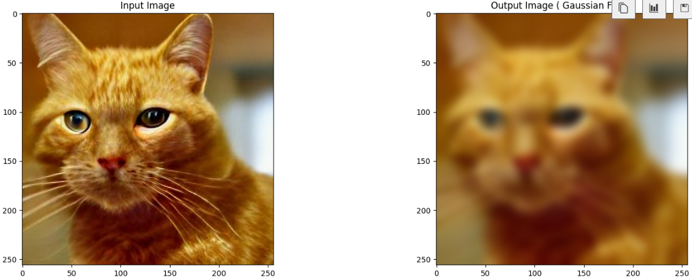
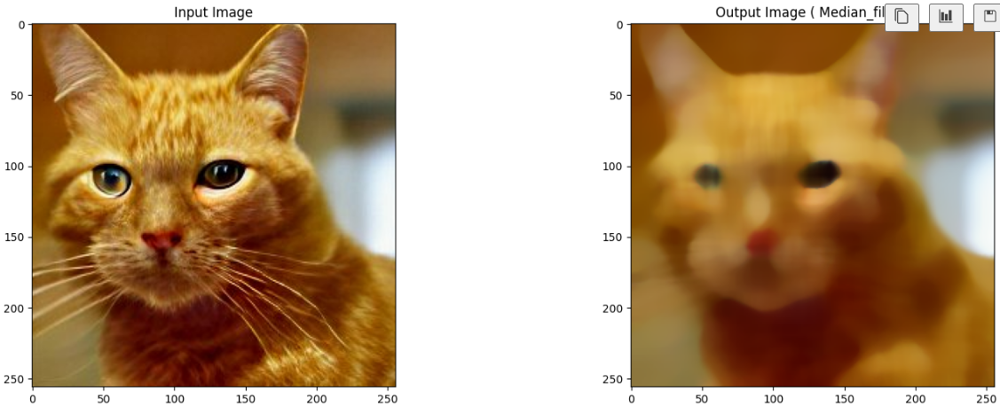
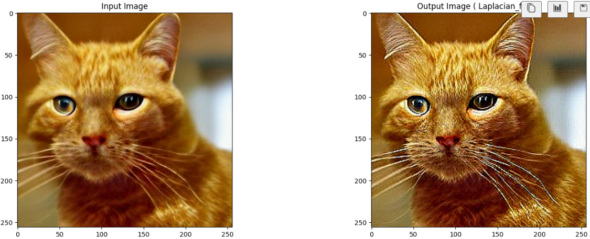
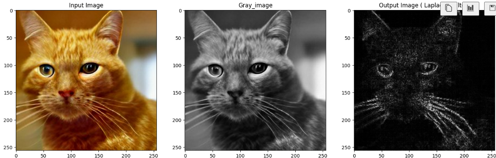

# Implementation-of-filter
## Aim:
To implement filters for smoothing and sharpening the images in the spatial domain.

## Software Required:
Anaconda - Python 3.7

## Algorithm:
### Step1
Import the required libraries.


### Step2
Convert the image from BGR to RGB.

### Step3
Apply the required filters for the image separately.

### Step4
Plot the original and filtered image by using matplotlib.pyplot.

### Step5
End the program.

## Program:
### Developed By   : SANJAY M
### Register Number: 212223230187
</br>

### 1. Smoothing Filters

```
import cv2
import numpy as np
import matplotlib.pyplot as plt
image = cv2.imread('cat.jpg', cv2.COLOR_BGR2RGB)
kernel = np.ones((5,5), dtype = np.float32) / 5**2
print (kernel)
```
i) Using Averaging Filter
```Python
image = cv2.imread('cat.jpeg')
dst = cv2.filter2D(image, ddepth = -1, kernel = kernel)
plt.figure(figsize = [20,10])
plt.subplot(121); plt.axis('off'); plt.imshow(image[:,:,::-1]); plt.title("Original Image")
plt.subplot(122); plt.axis('off'); plt.imshow(dst[:,:,::-1]);   plt.title("Convolution Result")
```
ii) Using Weighted Averaging Filter
```Python
average_filter = cv2.blur(image, (30,30))
plt.figure(figsize = (18, 6))
plt.subplot(121); plt.imshow(image [:, :, ::-1]); plt.title('Input Image')
plt.subplot(122); plt.imshow(average_filter[:, :, ::-1]); plt.title('Output Image ( Average Filter)')
```
iii) Using Gaussian Filter
```Python
gaussian_filter = cv2.GaussianBlur(image, (29,29), 0, 0)
plt.figure(figsize = (18, 6))
plt.subplot(121); plt.imshow(image [:, :, ::-1]); plt.title('Input Image')
plt.subplot(122); plt.imshow(gaussian_filter[:, :, ::-1]); plt.title('Output Image ( Gaussian Filter)')
```
iv)Using Median Filter
```Python
median_filter = cv2.medianBlur(image, 19)
plt.figure(figsize = (18, 6))
plt.subplot(121); plt.imshow(image [:, :, ::-1]); plt.title('Input Image')
plt.subplot(122); plt.imshow(median_filter[:, :, ::-1]); plt.title('Output Image ( Median_filter)')

```

### 2. Sharpening Filters
i) Using Laplacian Linear Kernal
```Python
laplacian_kernel = np.array([[0, -1, 0],[-1, 5, -1],[0, -1, 0]])
sharpened_laplacian_kernel = cv2.filter2D(image, -1, kernel = laplacian_kernel)
plt.figure(figsize = (18, 6))
plt.subplot(121); plt.imshow(image [:, :, ::-1]); plt.title('Input Image')
plt.subplot(122); plt.imshow(sharpened_laplacian_kernel[:, :, ::-1]); plt.title('Output Image ( Laplacian_filter)')
```
ii) Using Laplacian Operator
```Python
gray_image = cv2.cvtColor(image, cv2.COLOR_RGB2GRAY)
laplacian_operator = cv2.Laplacian(gray_image, cv2.CV_64F)
laplacian_operator = np.uint8(np.absolute(laplacian_operator))
plt.figure(figsize = (18, 6))
plt.subplot(131); plt.imshow(image [:, :, ::-1]); plt.title('Input Image')
plt.subplot(132); plt.imshow(gray_image, cmap='gray'); plt.title('Gray_image')
plt.subplot(133); plt.imshow(laplacian_operator,cmap='gray'); plt.title('Output Image ( Laplacian_filter)')
```

## OUTPUT:
### 1. Smoothing Filters
</br>

i) Using Averaging Filter


ii)Using Weighted Averaging Filter



iii)Using Gaussian Filter


iv) Using Median Filter


### 2. Sharpening Filters
</br>

i) Using Laplacian Kernal


ii) Using Laplacian Operator


## Result:
Thus the filters are designed for smoothing and sharpening the images in the spatial domain.
